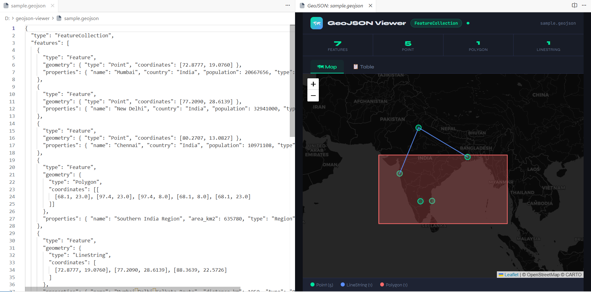
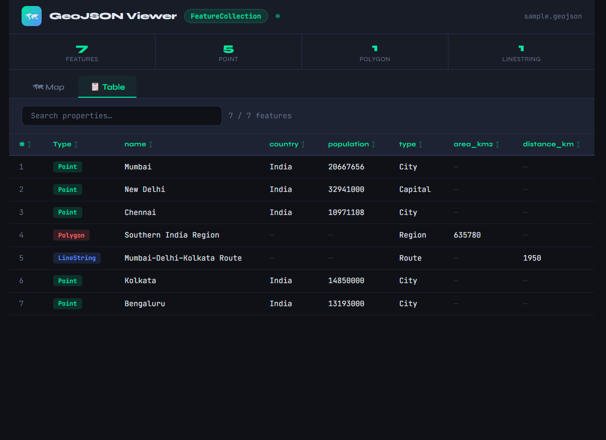
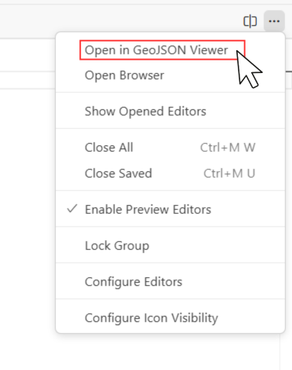

# GeoJSON Viewer — VS Code Extension

View any `.geojson` file as an **interactive map + data table** — directly inside VS Code.

---





## Features

- 🗺 **Interactive Map** — powered by Leaflet + CartoDB dark tiles
- 📋 **Data Table** — all feature properties in a searchable, sortable table
- 🔗 **Click-to-link** — click a table row to jump to that feature on the map
- 🏷 **Geometry badges** — Point, Polygon, LineString, etc. color-coded
- 📊 **Stats bar** — feature counts by geometry type at a glance
- 🔍 **Search** — filter features by any property value
- ↕ **Sort** — click any column header to sort

---

## Installation

### Option A — Run from source (development)

1. **Install dependencies** (none required — pure JS, no npm install needed)
2. Open this folder in VS Code:
   ```
   code /path/to/geojson-viewer
   ```
3. Press **F5** → a new VS Code window opens with the extension loaded
4. Open any `.geojson` file → the viewer opens automatically beside it

### Option B — Install as VSIX (share with others)

1. From the project folder, install dependencies and build the VSIX:
   ```bash
   cd geojson-viewer
   npm install
   npm run package
   ```
   (This uses `@vscode/vsce` from `devDependencies`.)
2. This creates `geojson-viewer-0.0.1.vsix` in the project root.
3. In VS Code: Extensions sidebar → `...` → **Install from VSIX…**

### Option C — Publish to the Visual Studio Marketplace

1. **Create a publisher** (if you do not have one): sign in at [Visual Studio Marketplace — manage publishers](https://marketplace.visualstudio.com/manage) and create a publisher. Its **ID** must match `"publisher"` in `package.json` (currently `mohammadvohra`).
2. **Personal Access Token (PAT)**:
   - Go to [Azure DevOps](https://dev.azure.com) → **User settings** → **Personal access tokens**.
   - Create a token with scope **Marketplace → Manage**.
3. **Log in and publish** from the project folder:
   ```bash
   npm install
   npx vsce login mohammadvohra
   npm run publish
   ```
   Or: `npx vsce publish -p <YOUR_PAT>` (non-interactive).
4. After upload, the listing appears on the Marketplace (and in VS Code search) within a few minutes. Bump `"version"` in `package.json` for each new release.

---

## Usage

| Action | Result |
|---|---|
| Open a `.geojson` file | Viewer opens automatically beside it |
| Click **Map** tab | See all features on an interactive dark map |
| Click **Table** tab | Browse all feature properties |
| Click a table row | Jumps to that feature on the map + opens popup |
| Type in search box | Filters features by any property value |
| Click a column header | Sorts the table by that column |

---

## How It Works

The extension uses VS Code's **Webview API** to render an HTML panel beside your editor. The panel contains:

- **Leaflet.js** for the map (loaded from CDN)
- **CartoDB dark tiles** as the basemap
- Vanilla JS table with search + sort

No build step, no webpack — just plain JS.

---

## File Structure

```
geojson-viewer/
├── src/
│   └── extension.js      ← main extension logic + webview HTML
├── assets/               ← README screenshots
├── package.json          ← VS Code extension manifest
├── LICENSE
└── README.md
```

---

## Supported GeoJSON Types

- `FeatureCollection` ✅
- `Feature` ✅
- Bare geometry objects (`Point`, `Polygon`, etc.) ✅
